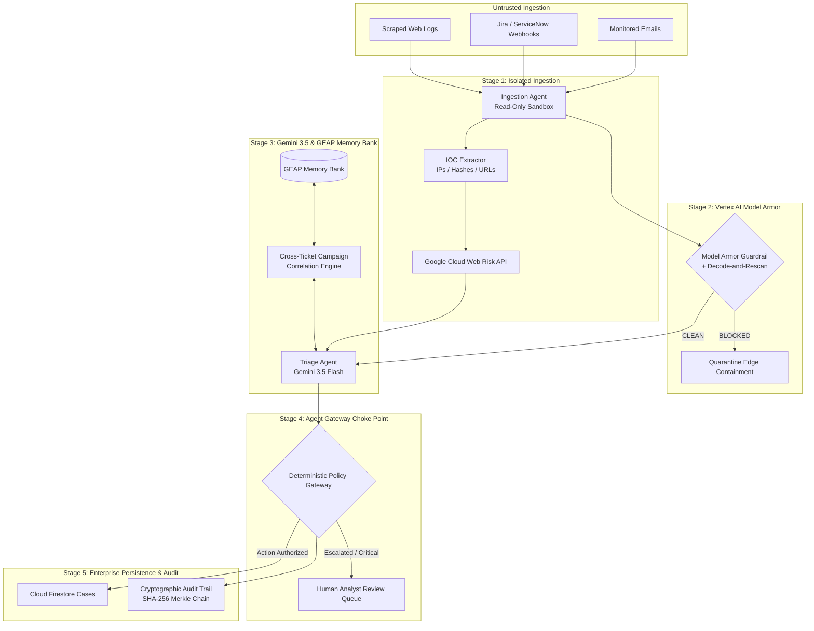

# SOC Analyst Agent — Zero-Trust Enterprise Pipeline

> **Hackathon Target:** [All Things Agentic Hackathon](https://allthingsagentichackathon.devpost.com/) · **Track:** *The Fortified Enterprise Fleet*  
> **Google Cloud Project:** `newproject-464521` (Project #`434061698035`, Region `us-central1`)  
> **Live HTTPS Web Console:** [https://soc-analyst-agent-ek2ft62bza-uc.a.run.app](https://soc-analyst-agent-ek2ft62bza-uc.a.run.app)  

---

## 1. Executive Overview

Enterprise Security Operations Centers (SOCs) process thousands of untrusted inputs daily (monitored emails, support tickets, web log streams). When autonomous AI agents process this raw data, they expose the enterprise to high-risk attack vectors: **prompt injections, jailbreaks, Base64/Hex obfuscation evasions, multi-stage campaign attacks, and malicious C2 URLs**.

The **SOC Analyst Agent** establishes a production-grade, zero-trust security pipeline built on **Google Cloud Platform**:
- **Vertex AI Model Armor** inline edge guardrail with **Pre-Screening Decode-and-Rescan** (closing Base64, Hexadecimal, and URL-encoding evasion gaps).
- **Google Cloud Web Risk API** (`webrisk.googleapis.com`) for real-time URL phishing and malware classification.
- **Gemini 3.5 Flash** for intelligent incident severity triage.
- **Gemini Enterprise Agent Platform (GEAP) Memory Bank** for domain-scoped context recall and **Multi-Stage Cross-Ticket Campaign Correlation**.
- **Deterministic Agent Gateway Policy Choke Point** enforcing read-only ingestion isolation and identity authority.
- **Immutable SHA-256 Cryptographic Audit Certificates** (SOC 2 / ISO 27001 legal auditing).
- **Inbound SIEM & ITSM Webhook Synchronization** (Jira Service Desk, ServiceNow).

---

## 2. System Architecture



---

## 3. Core Enterprise Capabilities

### A. Pre-Screening Decode-and-Rescan Edge Perimeter
Attackers wrap malicious prompts inside Base64, Hexadecimal, or URL-encoded tracking strings (e.g. `Ticket update ref#4471: <encoded_blob>`). `BaseModelArmor.screen()` extracts candidates, decodes printable strings, and re-screens them through Vertex AI Model Armor. If any candidate trips a filter, the case is auto-quarantined.

### B. Google Cloud Web Risk API Integration
Extracted URLs are screened against Google's global threat database (`webrisk.googleapis.com`) for `MALWARE`, `SOCIAL_ENGINEERING`, and `UNWANTED_SOFTWARE`.

### C. Multi-Stage Cross-Ticket Campaign Correlation
Attackers split prompt injections across separate support tickets (Ticket 1: System prompt override context $\rightarrow$ Ticket 2: Credential dump payload). The pipeline queries GEAP Memory Bank by sender domain, correlates Ticket $N$ with Ticket $N-1$, and escalates multi-stage injection attempts to `CRITICAL` (`multi-stage-campaign`).

### D. Immutable Cryptographic Audit Certificate Engine
Every processed case generates a tamper-evident SHA-256 Merkle chain audit certificate:
$$\text{Certificate Hash}_n = \text{SHA256}(\text{Hash}_{n-1} + \text{Case ID} + \text{Verdict} + \text{Actor Identity} + \text{Timestamp})$$

### E. Enterprise Inbound Webhook Synchronization
Native inbound webhooks (`/api/v1/webhooks/jira`, `/api/v1/webhooks/servicenow`, `/api/v1/webhooks/{source}`) capture analyst comments and status updates from Jira Service Desk and ServiceNow, reconciling status in Cloud Firestore.

---

## 4. API Endpoints Reference

| Endpoint | Method | Description |
| :--- | :---: | :--- |
| `POST /ingest` | `POST` | Ingests alert through the 4-stage zero-trust pipeline. |
| `GET /corpus` | `GET` | Fetches the 12 curated attack corpus preset cases. |
| `POST /api/v1/redteam/encode` | `POST` | Red Team Attack Studio payload mutator (Base64, Hex, URL, Ticket wrap). |
| `GET /api/v1/audit/verify/{case_id}` | `GET` | Cryptographically verifies SHA-256 Merkle audit certificate for a case. |
| `POST /api/v1/webhooks/jira` | `POST` | Inbound webhook handler for Jira Service Desk analyst updates. |
| `POST /api/v1/webhooks/servicenow` | `POST` | Inbound webhook handler for ServiceNow incident status updates. |
| `POST /api/admin/evals/run` | `POST` | Runs benchmark evals suite with LLM-as-a-Judge and payload mutation metrics. |
| `GET /health` | `GET` | Health check endpoint. |

---

## 5. Quickstart & Installation

```bash
# 1. Clone repository and activate Python 3.11 virtual environment
git clone https://github.com/aryan123197/soc-analyst-agent.git
cd soc-analyst-agent
source venv/bin/activate

# 2. Install dependencies
pip install -r requirements.txt

# 3. Configure environment variables (.env)
cp .env.example .env
# Set GOOGLE_CLOUD_PROJECT=newproject-464521
# Set GOOGLE_CLOUD_LOCATION=us-central1
# Set GEMINI_MODEL=gemini-3.5-flash

# 4. Run automated test suite (100% passing)
pytest tests/ -q

# 5. Launch local server
uvicorn soc_agent.server:app --reload --port 8000
```

Visit **`http://localhost:8000/`** to view the Web Console!

---

## 6. Deployment to Google Cloud Run

To deploy directly to Google Cloud Run:

```bash
./deploy.sh
```

The script builds the Docker container via Cloud Build and deploys to Cloud Run in `us-central1` with unauthenticated HTTP access.
