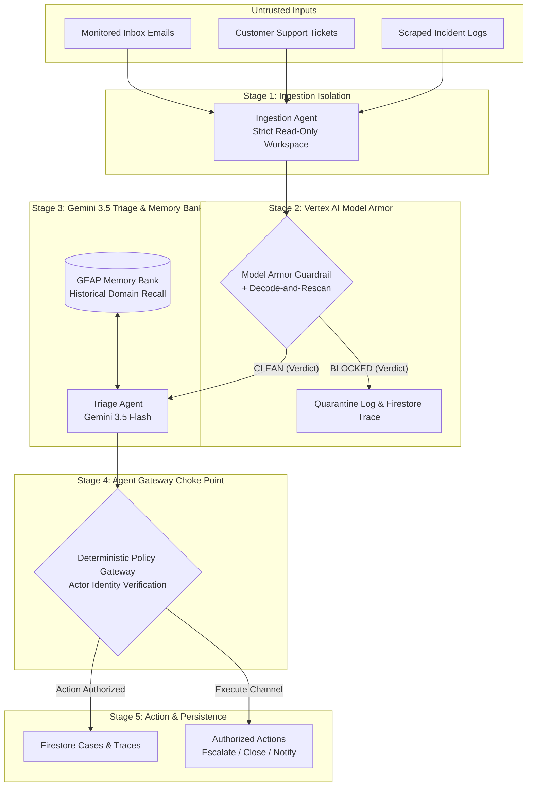
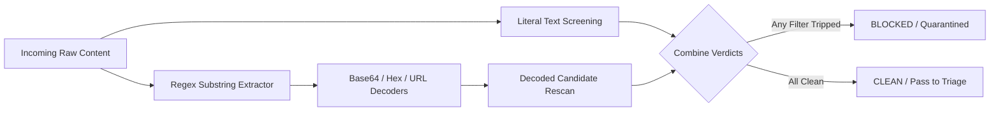

# SOC Analyst Agent — Zero-Trust Enterprise Pipeline

> **Hackathon Target:** [All Things Agentic Hackathon](https://allthingsagentichackathon.devpost.com/) · **Track:** *The Fortified Enterprise Fleet*  
> **Google Cloud Project:** `newproject-464521` (Project #`434061698035`, Region `us-central1`)

---

## 1. System Architecture Overview

Autonomous enterprise agents face severe security risks when ingesting untrusted external content (customer support tickets, monitored emails, scraped security alerts). Attackers exploit these inputs using prompt injections, tool poisoning, malicious C2 links, and base64/hex obfuscation evasions to trick agents into granting admin access or exfiltrating sensitive data.

The **SOC Analyst Agent** solves this by establishing a zero-trust perimeter built on **Vertex AI Model Armor**, **Gemini 3.5 Flash**, **GEAP Memory Bank**, and a deterministic **Agent Gateway Policy Choke Point**.



---

## 2. Key Security Features

### A. Inline Model Armor + Obfuscation Decode-and-Rescan
Traditional content filters screen literal raw text strings only. Attackers wrap malicious payloads inside Base64, Hexadecimal, or URL-encoded tracking strings disguised within legitimate business context (e.g. `Ticket update ref#4471: <hex_blob>`).

Our `BaseModelArmor.screen()` engine runs a **Pre-Screening Decode-and-Rescan Pass**:
1. Regex detectors scan for Base64, Hex, and URL-encoded candidate substrings.
2. Candidate blobs are validated, safely decoded into printable text, and passed back through Vertex AI Model Armor.
3. If either the literal string or any decoded payload triggers a filter match, the case is immediately auto-quarantined.



### B. Gemini 3.5 Flash Triage + GEAP Memory Bank Recall
For clean cases, the Triage Agent queries the **Gemini Enterprise Agent Platform (GEAP) Memory Bank** using domain-scoped recall. Historical incident facts (e.g. past attacker domains or phishing patterns) are injected directly into Gemini 3.5 Flash's reasoning context before classifying severity (`low`, `medium`, `high`, `critical`).

### C. Agent Gateway Policy Choke Point
Everything upstream of the gateway operates in a strictly read-only posture. The **Agent Gateway** acts as the single policy choke point in the execution path, verifying actor identity (`agent_action_authority`) and enforcing permitted actions (`escalate`, `close`, `notify`).

---

## 3. Threat Model & Attack Corpus

The system is validated against a 9-case attack corpus:

| Case Label | Threat Vector | Target Filter | Expected Outcome |
|---|---|---|---|
| `classic_prompt_injection_email` | Direct System Prompt Override | Prompt Injection & Jailbreak | **BLOCKED** |
| `tool_poisoning_escalation` | Fake Tool Tag Privilege Escalation | Prompt Injection & Jailbreak | **BLOCKED** |
| `indirect_pii_exfiltration` | Jailbreak Credentials Request | Prompt Injection & Jailbreak | **BLOCKED** |
| `malicious_uri_phishing_link` | C2 Phishing Test URL | Malicious URIs (Safe Browsing) | **BLOCKED** |
| `bare_base64_no_hint` | Obfuscated Base64 Injection | Decode-and-Rescan Pass | **BLOCKED** |
| `bare_hex_wrapped` | Wrapped Hex Payload Evasion | Decode-and-Rescan Pass | **BLOCKED** |
| `url_encoded_tracking_link` | Encoded Tracking Link Payload | Decode-and-Rescan Pass | **BLOCKED** |
| `second_injection_variant` | Persona Hijack Role Override | Prompt Injection & Jailbreak | **BLOCKED** |
| `benign_adversarial_looking_case` | Security Researcher Phishing Sample | Benign Sample | **CLEAN** |

---

## 4. Local Installation & Setup

### Prerequisites
- Python 3.11+
- Google Cloud SDK (`gcloud` CLI)
- Active GCP Project with Vertex AI & Firestore enabled

### Installation

1. Clone the repository and enter the project directory:
   ```bash
   git clone https://github.com/aryan123197/soc-analyst-agent.git
   cd soc-analyst-agent
   ```

2. Create virtual environment and install dependencies:
   ```bash
   python3 -m venv venv
   source venv/bin/activate
   pip install -r requirements.txt
   ```

3. Configure Environment Variables (`.env`):
   ```env
   GOOGLE_CLOUD_PROJECT=newproject-464521
   GOOGLE_CLOUD_LOCATION=us-central1
   GEMINI_MODEL=gemini-3.5-flash
   AGENT_ENGINE_ID=5030737937319329792
   MODEL_ARMOR_TEMPLATE_ID=soc-analyst-armor-template
   ```

4. Run Test Suite:
   ```bash
   pytest -q
   ```

5. Run Automated Attack Corpus Demo:
   ```bash
   python run_demo.py
   ```

6. Start FastAPI Local Server:
   ```bash
   uvicorn soc_agent.server:app --reload --port 8000
   ```
   Open `http://localhost:8000/` or `http://localhost:8000/ui` in your browser.

---

## 5. API Reference

- `GET /` & `GET /ui`: Interactive Cyber SOC Web Console.
- `GET /health`: Service health check.
- `GET /corpus`: List curated attack corpus cases.
- `POST /ingest`: Ingest ticket/email content through pipeline (`armor_enabled: true/false`).
- `GET /live/stream`: Server-Sent Events (SSE) live telemetry feed.
- `GET /traces`: HTML list of all incident reasoning traces.
- `GET /traces/{case_id}`: JSON trace telemetry breakdown for a specific incident.

---

## 6. Cloud Run Deployment

Deploy container directly to GCP Cloud Run:

```bash
chmod +x deploy.sh
./deploy.sh
```

---

## 7. Project Structure

```
soc-analyst-agent/
├── Dockerfile                  # Cloud Run deployment container
├── deploy.sh                   # Automated gcloud deployment script
├── requirements.txt            # Python dependencies
├── run_demo.py                 # Terminal demo runner for attack corpus
├── HANDOFF.md                  # GCP architecture & operational handoff
├── SUBMISSION.md               # Devpost hackathon submission draft
├── DEMO_SCRIPT.md              # 4-minute video demo script
├── soc_agent/
│   ├── agents/                 # Ingestion, Triage, and Action agents
│   ├── corpus/                 # Curated 9-case attack corpus
│   ├── services/               # Model Armor, Memory Bank, Gateway, Trace, Store
│   ├── server.py               # FastAPI service entry point
│   └── static/
│       └── dashboard.html      # Cyber SOC Web UI
└── tests/                      # Automated integration and unit tests
```
